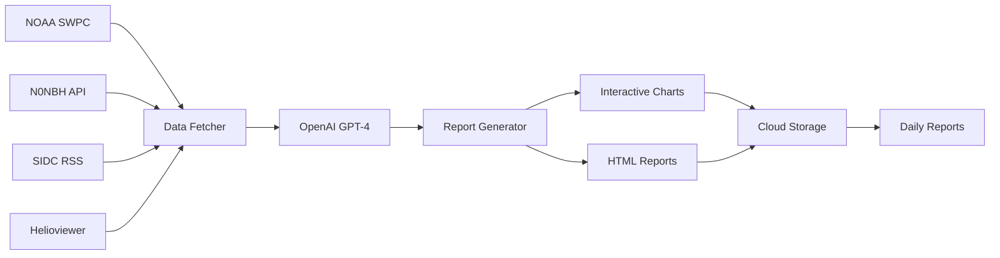

# Radio Propagation Service 📡

An intelligent amateur radio propagation reporting service that generates comprehensive daily reports by analyzing real-time solar and geomagnetic data using AI. The service provides detailed band-by-band propagation forecasts with interactive visualizations to help amateur radio operators optimize their communications.

## 🌟 Live Example

Visit the production service at **[radio-propagation.net](https://radio-propagation.net)** to see live reports with:
- Real-time solar activity analysis
- Interactive propagation charts
- Band-by-band recommendations
- 3-day forecasts
- DX opportunity predictions

## 🎯 Purpose

This service addresses the amateur radio community's need for:
- **Intelligent Analysis**: AI-powered interpretation of complex space weather data
- **Actionable Insights**: Clear recommendations for each amateur radio band (10m-80m)
- **Visual Data**: Interactive charts showing trends and forecasts
- **Accessibility**: Easy-to-understand reports for operators of all experience levels
- **Automation**: Daily reports generated without manual intervention

## 🏗️ Architecture



**Data Flow:**
1. **Collection**: Fetch solar/geomagnetic data from multiple authoritative sources
2. **Analysis**: OpenAI GPT-4 analyzes conditions and generates insights
3. **Visualization**: Create interactive charts using go-echarts
4. **Generation**: Combine analysis and charts into comprehensive HTML reports
5. **Storage**: Deploy reports to cloud storage with automated scheduling

## 🚀 Quick Start

### Prerequisites

- **Go 1.21+** - Programming language runtime
- **OpenAI API Key** - For AI-powered analysis ([get one here](https://platform.openai.com/api-keys))
- **Google Cloud Project** - For production deployment (optional for local testing)

### Local Development

1. **Clone and setup**:
```bash
git clone https://github.com/vpoluyaktov/radiocast.git
cd radiocast/service
go mod download
```

2. **Set your OpenAI API key**:
```bash
export OPENAI_API_KEY='sk-your-openai-key-here'
```

3. **Run the local server** (from the `service/` directory):
```bash
./run_local.sh server
```

This will:
- ✅ Kill any existing process on port 8981
- 📡 Fetch real data from NOAA, N0NBH, and SIDC
- 🤖 Generate a report using OpenAI GPT-4
- 🌞 Download Sun images from Helioviewer
- 📊 Create HTML with interactive charts
- 🌐 Start server on http://localhost:8981

4. **Test the service**:
```bash
# Health check
curl http://localhost:8981/health

# Generate a new report
curl -X POST http://localhost:8981/generate

# View reports in browser
open http://localhost:8981
```

### Fast Testing with Mock Data

For rapid development without API calls:
```bash
./run_local.sh server --mockup
```

## 📊 Report Features

Generated reports include comprehensive analysis with:

### 📈 Interactive Charts
- **Solar Activity**: Real-time solar flux, sunspot numbers, and K-index
- **K-index Trend**: 72-hour history with exponential moving average
- **Band Conditions**: Heatmap showing day/night conditions for all amateur bands
- **3-Day Forecast**: Predicted K-index and propagation quality
- **Propagation Timeline**: Dual-axis charts showing solar flux and geomagnetic activity

### 📋 Analysis Sections
1. **Executive Summary** - Current conditions overview
2. **Solar Activity Analysis** - SFI, sunspot numbers, flare activity
3. **Geomagnetic Conditions** - K-index, A-index, storm levels
4. **Band-by-Band Analysis** - Specific recommendations for each amateur band (10m-80m)
5. **3-Day Forecast** - Predicted conditions and operating recommendations
6. **DX Opportunities** - Enhanced propagation paths and timing
7. **Technical Explanation** - Educational content for new operators

## 🛠️ Development Tools

### Available Commands

**Note**: All `./run_local.sh` commands must be run from the `service/` directory.

```bash
# Run complete local test with real data
./run_local.sh server

# Fast testing with mock data (no API calls)
./run_local.sh server --mockup

# Test all external API endpoints
./run_local.sh debug-apis

# Run unit tests
./run_local.sh unit-tests

# Show help
./run_local.sh help
```

### Testing & Quality

The project includes comprehensive unit tests with high coverage:
- **Config Package**: ~85% coverage
- **Models Package**: ~90% coverage  
- **Storage Package**: 55.6% coverage
- **Charts Package**: 92.2% coverage

```bash
# Run all tests
go test -v ./...

# Run tests with coverage
go test -v -cover ./...
```

## 🌐 API Endpoints

### `GET /` - Main Page
- Displays the latest report or auto-generates one if none exist
- Shows loading page with spinner during generation
- Auto-refreshes every 10 seconds until report is ready

### `GET /health` - Health Check
Health check endpoint for monitoring and load balancers.

### `POST /generate` - Generate Report
Generates a new propagation report with concurrency protection.

**Response (Success)**:
```json
{
  "status": "success", 
  "report_url": "https://radio-propagation.net/2024/01/15/index.html",
  "timestamp": "2024-01-15T12:00:00Z",
  "duration_ms": 45000,
  "data_summary": {
    "solar_flux": 150.2,
    "k_index": 2.3,
    "sunspot_number": 45,
    "activity_level": "Moderate"
  }
}
```

**Response (Concurrent Request)**:
```json
{
  "error": "Report generation already in progress",
  "status": "conflict"
}
```
*HTTP 409 Conflict - Only one report can be generated at a time*

### `GET /reports?limit=10` - List Reports
Lists recent reports with metadata and direct links.

## ⚙️ Configuration

| Variable | Description | Default | Required |
|----------|-------------|---------|----------|
| `OPENAI_API_KEY` | OpenAI API key for GPT-4 | - | ✅ |
| `OPENAI_MODEL` | OpenAI model to use | `gpt-4.1` | ❌ |
| `PORT` | HTTP server port | `8981` | ❌ |
| `ENVIRONMENT` | Deployment environment | `local` | ❌ |
| `GCP_PROJECT_ID` | GCP project (production only) | - | ❌ |
| `GCS_BUCKET` | GCS bucket (production only) | - | ❌ |

## 📡 Data Sources

The service integrates with multiple authoritative space weather data sources:

### 🌞 NOAA Space Weather Prediction Center
- **Website**: [swpc.noaa.gov](https://www.swpc.noaa.gov/)
- **K-index Data**: Real-time planetary geomagnetic activity
- **Solar Cycle Data**: Solar flux index and sunspot numbers
- **Reliability**: Primary government source for space weather

### 📊 N0NBH Solar Data API  
- **Website**: [hamqsl.com](https://www.hamqsl.com/)
- **Band Conditions**: Real-time HF propagation conditions for all amateur bands
- **Formatted Data**: Pre-processed amateur radio specific metrics
- **Update Frequency**: Multiple times per day

### 🌍 SIDC (Solar Influences Data Analysis Center)
- **Website**: [sidc.be](https://www.sidc.be/)
- **Solar Events**: Flare reports and space weather events
- **International Data**: European Space Agency collaboration
- **RSS Feed**: Real-time event notifications

### 🌞 Helioviewer Project
- **Website**: [helioviewer.org](https://helioviewer.org/)
- **Solar Images**: Real-time Sun imagery from SDO/AIA instruments
- **Visual Context**: Provides visual representation of solar activity
- **NASA Data**: Direct integration with space-based solar observatories

## 🏗️ Project Structure

```
radiocast/
├── service/                    # Go application
│   ├── main.go                # HTTP server entry point
│   ├── internal/
│   │   ├── config/            # Configuration management
│   │   ├── fetchers/          # Data source integrations  
│   │   ├── llm/               # OpenAI GPT-4 integration
│   │   ├── models/            # Data structures & types
│   │   ├── reports/           # HTML generation & templates
│   │   ├── charts/            # Interactive chart generation
│   │   ├── storage/           # Local & cloud storage
│   │   ├── server/            # HTTP handlers & middleware
│   │   └── imagery/           # Solar image processing
│   ├── templates/             # HTML & CSS templates
│   ├── run_local.sh          # Development runner script
│   └── Dockerfile            # Container build
├── terraform/                 # Infrastructure as Code
│   ├── stage/                # Staging environment
│   └── prod/                 # Production environment
└── .github/workflows/        # CI/CD automation
```

## 🚀 Production Deployment

The service runs on Google Cloud Platform with automated CI/CD:

- **Production URL**: [radio-propagation.net](https://radio-propagation.net)
- **Staging Environment**: Automatic deployment from `stage` branch
- **Production Environment**: Automatic deployment from `main` branch
- **Infrastructure**: Managed via Terraform
- **Scheduling**: Daily report generation via Cloud Scheduler
- **Storage**: Reports stored in Google Cloud Storage
- **Monitoring**: Cloud Run metrics and custom alerts

## 🤝 Contributing

1. **Fork** the repository
2. **Create** a feature branch (`git checkout -b feature/amazing-feature`)
3. **Add tests** for new functionality
4. **Commit** changes (`git commit -m 'Add amazing feature'`)
5. **Push** to branch (`git push origin feature/amazing-feature`)
6. **Open** a Pull Request

### Development Guidelines
- Maintain high test coverage (aim for >80%)
- Follow Go best practices and conventions
- Add unit tests for new packages/functions
- Update documentation for API changes

## 📄 License

This project is licensed under the MIT License - see the [LICENSE](LICENSE) file for details.

## 📞 Support

- **Issues**: [GitHub Issues](https://github.com/vpoluyaktov/radiocast/issues)
- **Discussions**: [GitHub Discussions](https://github.com/vpoluyaktov/radiocast/discussions)
- **Live Example**: [radio-propagation.net](https://radio-propagation.net)

---

**73! Happy DXing!** 📡🌍
