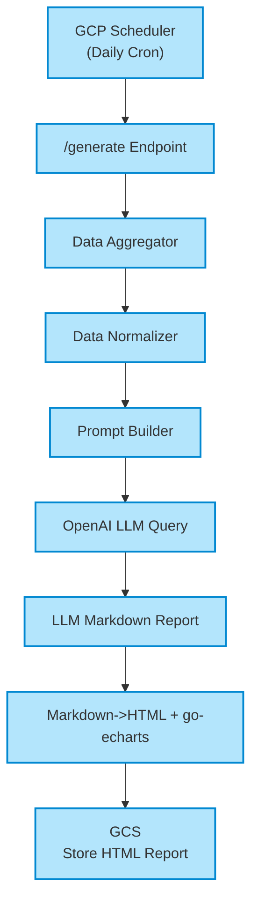
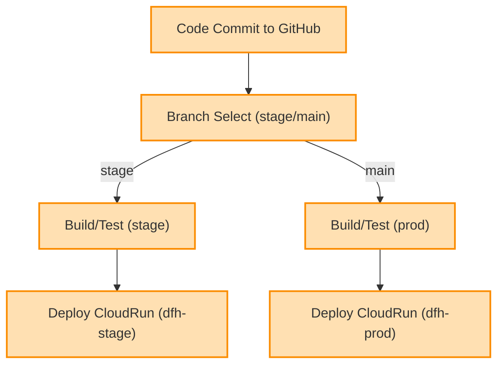
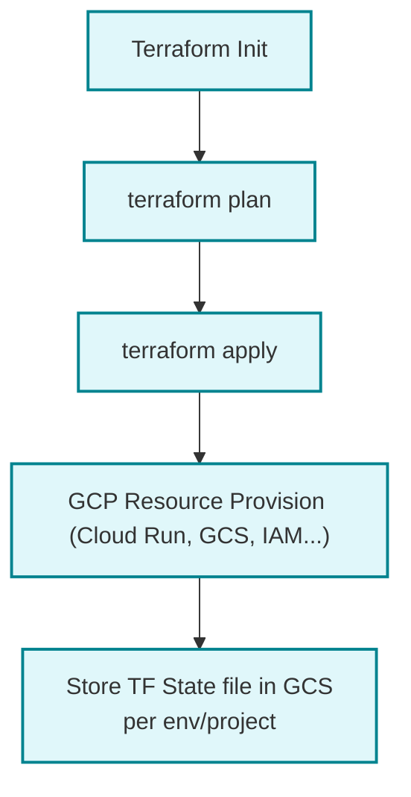

## Radio Propagation Service – Detailed Specification

---

### 1. **Project Overview**

The Radio Propagation Service is a backend application written in Go, designed to collect, analyze, and report daily radio propagation conditions for amateur radio enthusiasts. It consolidates solar and space weather data from authoritative sources, generates Markdown reports via OpenAI LLM, converts reports to structured HTML (including charts via go-echarts), and stores them in Google Cloud Storage (GCS). The service supports staged and production deployments via CI/CD on GCP Cloud Run.

---

### 2. **Versioning Strategy**

The project uses semantic versioning (SemVer) for Docker images and releases:

- **Production Format**: `v{MAJOR}.{MINOR}.{PATCH}` (e.g., `v0.1.0`)
- **Staging Format**: `v{MAJOR}.{MINOR}.{PATCH}-rc.{N}` (e.g., `v0.1.0-rc.1`)
- **Docker Tags**: Images are tagged with semantic versions instead of Git SHA
- **Automatic Increment**: 
  - Staging deployments automatically increment RC version
  - Production deployments automatically increment patch version
- **Manual Control**: Use `./scripts/bump-version.sh [major|minor|patch|stage]` for manual version bumps
- **Version File**: Current version stored in `/VERSION` file at project root

**Version Increment Rules**:
- **PATCH**: Bug fixes, minor updates (auto-incremented on prod deployment)
- **MINOR**: New features, backward-compatible changes (manual)
- **MAJOR**: Breaking changes, major releases (manual)
- **STAGE**: Pre-release candidates for staging (auto-incremented on stage deployment)

**Version Flow Example**:
```
v0.1.0 → v0.1.0-rc.1 → v0.1.0-rc.2 → v0.1.1 → v0.1.1-rc.1 → v0.1.2
```

### 3. **Application Architecture Overview**


---

### 3. **Component Details**

| Component                 | Description                                                                              |
|---------------------------|------------------------------------------------------------------------------------------|
| Data Fetcher              | Collects solar/space weather data from NOAA SWPC, N0NBH API, and SIDC RSS.              |
| Data Normalizer           | Normalizes all incoming data to a common internal struct format.                         |
| Prompt Builder            | Generates a detailed prompt (with all relevant data) for OpenAI API.                     |
| OpenAI Integration        | Calls OpenAI LLM (e.g., GPT-4 API) with prompt, receives Markdown summary report.        |
| Report Generator          | Renders Markdown as HTML, embeds go-echarts charts (solar activity, K-index, etc).      |
| Scheduler                 | Uses GCP Scheduler to hit /generate endpoint daily (UTC midnight or customized).         |
| Storage Handler           | Saves generated report as HTML to GCS bucket (with pathing: YYYY/MM/DD/PropagationReport-YYYY-MM-DD-HH-MI-SS.html). |
| Configuration/Secrets     | Managed via GCP Secret Manager or env vars (for OpenAI keys, API keys, etc.)            |
| Infra Provisioning        | Infrastructure managed via Terraform/Chef, with backend on GCS; separate state for stage/prod. |
| CI/CD Pipeline            | Uses Github Actions for build, test, deploy workflows; deploys stage branch to dfh-stage, main to dfh-prod. |

---

### 4. **Functional Requirements**

#### 4.1 Data Ingestion
- Fetches and parses:
    - **NOAA SWPC RSS/JSON**: Solar flux, K-index, 3-day forecast
    - **N0NBH Solar Data**: JSON, solar conditions & band openings
    - **SIDC RSS**: Solar event alerts
- Supports error handling, timeouts, and retries.

#### 4.2 Data Analysis & Prompting
- Normalizes all source data into a unified structure.
- Constructs an intelligent, descriptive prompt for OpenAI:
    - Summarized measurements and notable events
    - Request for band condition analysis, propagation advice, and user-friendly explanations

#### 4.3 LLM-driven Reporting
- Calls OpenAI LLM, passing data prompt; expects Markdown summary as output.
- Handles LLM response formatting and error handling.

#### 4.4 Report Rendering (HTML/charts)
- Converts LLM Markdown report to HTML.
- Generates interactive charts (using go-echarts) for:
    - Solar flux/SSN trends
    - K/P indices over time
    - Band condition recommendations
- Embeds all graphs/charts and annotations in final HTML.

#### 4.5 Scheduling & Automation
- Exposes `/generate` REST endpoint.
- GCP Scheduler triggers this endpoint on a set schedule (e.g., each day at 00:00 UTC).

#### 4.6 Report Storage
- Saves the HTML report to the GCS bucket as:
    ```
    <bucket>/{YYYY}/{MM}/{DD}/PropagationReport-YYYY-MM-DD-HH-MM-SS.html
    ```

#### 4.7 Environment Separation & Deployment
- **Two GCP Projects**:
    - dfh-stage (stage branch)
    - dfh-prod (main branch)
- All configuration, GCS buckets, and backends separated per project/env.

---

### 5. **Non-functional Requirements**

| Requirement              | Details                                           |
|--------------------------|---------------------------------------------------|
| Logging & Monitoring     | Structured logs, error alerts, GCP Operations (Stackdriver) |
| Security                 | Use service accounts, least privilege, all secrets in Secret Manager |
| Reliability              | Retries and fallback for failed fetches or OpenAI errors   |
| Code Structure           | Go follows standard `/internal` package layout, modular Terraform infrastructure |
| Portability              | CI/CD deploys same container to both environments |
| Documentation            | Clear README, usage, and infra instructions      |

---

### 6. **Folder Structure**

```plain
/radiocast
  /service      // Go application source
    main.go
    go.mod
    go.sum
    Dockerfile
    .dockerignore
    main_test.go
    /internal   // Internal packages (standard Go layout)
      /config     // Configuration management
        config.go
      /fetchers   // Data fetching logic
        fetcher.go
        fetcher_test.go
      /llm        // OpenAI integration
        openai.go
      /models     // Data structures
        data.go
      /reports    // Report generation
        generator.go
      /storage    // GCS storage
        gcs.go
  /terraform    // Terraform infrastructure (modular)
    main.tf       // Shared resources
    variables.tf  // Variable definitions
    backend.tf    // Backend configuration
    outputs.tf    // Output definitions
    stage.tfvars  // Staging environment variables
    prod.tfvars   // Production environment variables
    /stage        // Environment-specific backend configs
      backend.tf
    /prod
      backend.tf
  /.github
    /workflows
      stage.yml   // Staging deployment pipeline
      prod.yml    // Production deployment pipeline
  README.md
  Specification.md
  .gitignore
```

---

### 7. **CI/CD Requirements**

| Environment  | Github Branch | CI/CD Triggers (Github Actions)                                 | GCP Project    | GCS bucket Separation            |
|--------------|--------------|-----------------------------------------------------------------|---------------|-----------------------------------|
| Staging      | stage        | On push/PR to stage: build/test/deploy to CloudRun (dfh-stage)  | dfh-stage     | e.g. gs://dfh-stage-reports/     |
| Production   | main         | On push/PR to main: build/test/deploy to CloudRun (dfh-prod)    | dfh-prod      | e.g. gs://dfh-prod-reports/      |
| Both         | Any          | GCS backend for Terraform state storage, isolated per project   | Both          | e.g. gs://dfh-stage-tfstate/, gs://dfh-prod-tfstate/ |

---

### 8. **Key Go Packages to Use**

| Purpose         | Go Package                             |
|-----------------|---------------------------------------|
| HTTP Client     | net/http, github.com/go-resty/resty   |
| Parsing RSS/XML | github.com/mmcdole/gofeed             |
| JSON Handling   | encoding/json                         |
| Markdown->HTML  | github.com/russross/blackfriday/v2    |
| Echarts         | github.com/go-echarts/go-echarts/v2   |
| Cloud Storage   | cloud.google.com/go/storage           |
| LLM API         | github.com/sashabaranov/go-openai (or direct HTTP) |
| Scheduling      | Trigger from GCP Scheduler (REST call to /generate) |
| Env/Secrets     | os, github.com/sethvargo/go-envconfig, Secret Manager API |

---

### 9. **Detailed Workflows**

#### 9.1 Daily Propagation Report Generation



#### 9.2 CI/CD Workflow



#### 9.3 Terraform Workflow (Infrastructure)



---

### 10. **Terraform State Backend Example**

**Sample backend config (for each env/proj):**
```hcl
terraform {
  backend "gcs" {
    bucket  = "dfh-stage-tfstate"       # or "dfh-prod-tfstate"
    prefix  = "terraform/state"
  }
}
```

---

## 11. **Report Structure (HTML Output Example)**

- Header: Date, summary, quick indicators (A-index, K-index, SFI, etc.)
- Body
    - Explanation (from LLM) in well-structured sections
    - Suggested best bands, times for DX, general advice
    - Highlights of solar/space weather events
    - Interactive charts:
        - SFI/K-Index/P-index 72 hour trend
        - Band opening likelihoods
    - Source references

---

### 12. **Deployment Notes**

- All configuration (API keys, project IDs, bucket names) must be environment-variable driven.
- Use IAM/service accounts for Cloud Storage and Secret Manager access.
- Terraform manages all infrastructure with modular configuration files.
- CI/CD workflows use Terraform for deployment instead of direct gcloud commands.
- Environment variables passed to Terraform via `TF_VAR_` prefix for secure secret handling.

---

### 13. **Testing & Monitoring**

- Unit tests for key components (fetchers, parser, LLM handler, renderer)
- Integration/E2E tests for `/generate` endpoint
- Healthcheck endpoint for Cloud Run
- Log to stdout/stderr (GCP Cloud Logging pickup)

---

## 14. **Recent Updates (August 2025)**

### Project Refactoring Completed:
- **Go Structure**: Migrated to standard `/internal` package layout following Go best practices
- **Terraform Modularization**: Restructured infrastructure into modular files with shared configurations
- **Import Path Updates**: All internal package references updated to new structure
- **CI/CD Enhancement**: Workflows now use Terraform for deployment with proper secret handling
- **Environment Separation**: Clean separation between staging and production configurations

### Key Architectural Improvements:
- Maintainable code structure with proper package organization
- Modular Terraform configuration with environment-specific variables
- Secure secret management through `TF_VAR_` environment variables
- Standardized deployment process using infrastructure as code

### Template and Configuration Externalization (Latest Update):
- **LLM System Prompt**: Externalized to `/service/internal/templates/system_prompt.txt` for easy modification without code changes
- **HTML Report Template**: Separated into `/service/internal/templates/report_template.html` with placeholder support for dynamic content
- **CSS Styles**: Moved to `/service/internal/templates/report_styles.css` for independent styling customization
- **Markdown Conversion**: Adopted `blackfriday/v2` library for reliable markdown to HTML conversion
- **Root Endpoint Enhancement**: GET `/` now serves the latest generated report HTML directly, falling back to service information page when no reports exist

## 15. **Open Questions**

- Which LLM model/temperature/completion settings required? Use GPT-4.1 for now
- Exact chart types and data fields to visualize with go-echarts? Up to you
- Is multi-language reporting required (now or future)? No
- Any manual override/edit for reports, or system-generated only? No

---

## 16. **Sample External Dependencies**

| Type                 | Example URL/Endpoint                                        |
|----------------------|------------------------------------------------------------|
| NOAA SWPC RSS        | https://services.swpc.noaa.gov/json/planetary_k_index_1m.json |
| N0NBH Solar API      | https://www.hamqsl.com/solarapi.php?format=json            |
| SIDC RSS             | https://www.sidc.be/products/meu                              |
| OpenAI API           | https://api.openai.com/v1/chat/completions                  |

---
