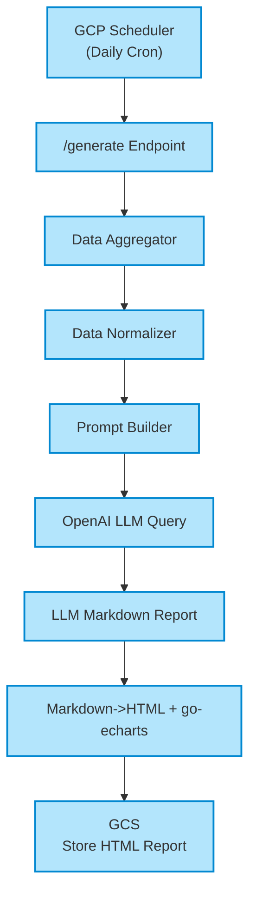
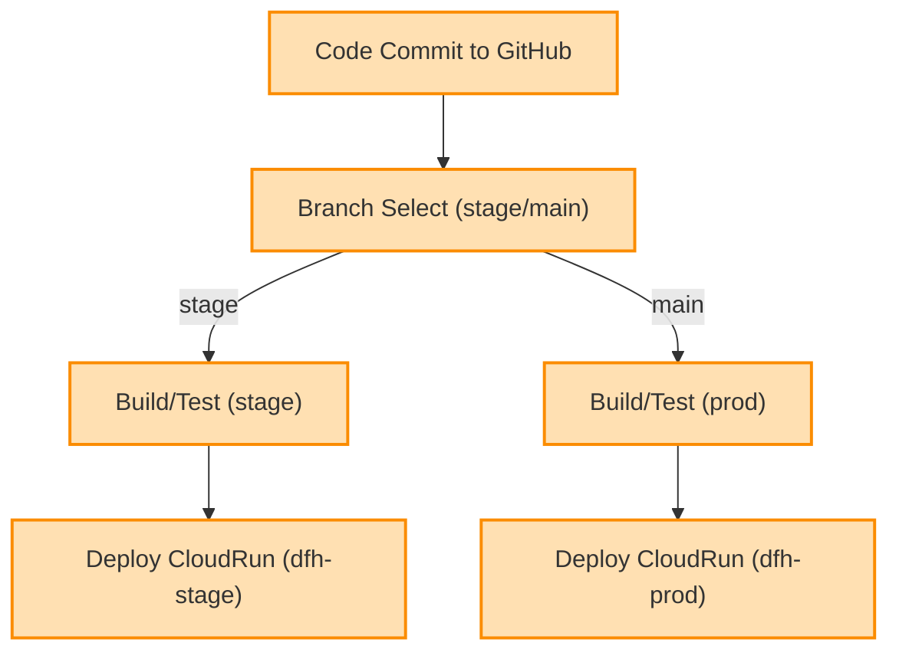
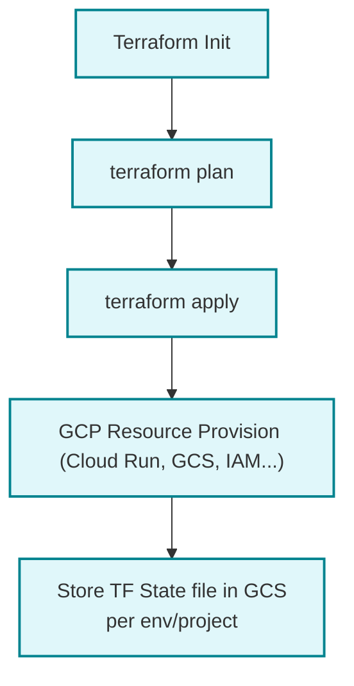

# Radio Propagation Service – Specification

## 1. Project Overview

The Radio Propagation Service is a Go-based application that generates daily radio propagation reports for amateur radio operators. It fetches solar and geomagnetic data from multiple sources, uses OpenAI LLM to generate comprehensive reports, and creates both interactive HTML charts and PNG chart images for enhanced visualization.

**Key Features:**
- Automated data collection from NOAA SWPC, N0NBH, and SIDC sources
- AI-powered report generation using OpenAI GPT models
- Interactive HTML charts with go-echarts library
- PNG chart image generation and GCS upload for production deployment
- Dual deployment modes: local testing and GCP Cloud Run production
- Comprehensive CI/CD pipeline with GitHub Actions
- Infrastructure as Code using Terraform

## 2. Versioning Strategy

The project uses semantic versioning (SemVer) for Docker images and releases:

- **Production Format**: `v{MAJOR}.{MINOR}.{PATCH}` (e.g., `v0.1.0`)
- **Staging Format**: `v{MAJOR}.{MINOR}.{PATCH}-rc.{N}` (e.g., `v0.1.0-rc.1`)
- **Docker Tags**: Images are tagged with semantic versions instead of Git SHA
- **Automatic Increment**: 
  - Staging deployments automatically increment RC version
  - Production deployments automatically increment patch version
- **Manual Control**: Use `./scripts/bump-version.sh [major|minor|patch|stage]` for manual version bumps
- **Version File**: Current version stored in `/VERSION` file at project root

**Version Increment Rules**:
- **PATCH**: Bug fixes, minor updates (auto-incremented on prod deployment)
- **MINOR**: New features, backward-compatible changes (manual)
- **MAJOR**: Breaking changes, major releases (manual)
- **STAGE**: Pre-release candidates for staging (auto-incremented on stage deployment)

**Version Flow Example**:
```
v0.1.0 → v0.1.0-rc.1 → v0.1.0-rc.2 → v0.1.1 → v0.1.1-rc.1 → v0.1.2
```

## 3. Application Architecture


## 4. Component Details

| Component                 | Description                                                                              |
|---------------------------|------------------------------------------------------------------------------------------|
| Data Fetcher              | Collects solar/space weather data from NOAA SWPC, N0NBH API, and SIDC RSS.              |
| Data Normalizer           | Normalizes all incoming data to a common internal struct format.                         |
| Prompt Builder            | Generates a detailed prompt (with all relevant data) for OpenAI API.                     |
| OpenAI Integration        | Calls OpenAI LLM (e.g., GPT-4 API) with prompt, receives Markdown summary report.        |
| Report Generator          | Renders Markdown as HTML, embeds go-echarts charts (solar activity, K-index, etc).      |
| Scheduler                 | Uses GCP Scheduler to hit /generate endpoint daily (UTC midnight or customized).         |
| Storage Handler           | Saves generated report as HTML to GCS bucket (with pathing: YYYY/MM/DD/PropagationReport-YYYY-MM-DD-HH-MI-SS.html). |
| Configuration/Secrets     | Managed via GCP Secret Manager or env vars (for OpenAI keys, API keys, etc.)            |
| Infra Provisioning        | Infrastructure managed via Terraform/Chef, with backend on GCS; separate state for stage/prod. |
| CI/CD Pipeline            | Uses Github Actions for build, test, deploy workflows; deploys stage branch to dfh-stage, main to dfh-prod. |

## 5. Functional Requirements

#### 4.1 Data Ingestion
- Fetches and parses:
    - **NOAA SWPC RSS/JSON**: Solar flux, K-index, 3-day forecast
    - **N0NBH Solar Data**: JSON, solar conditions & band openings
    - **SIDC RSS**: Solar event alerts
- Supports error handling, timeouts, and retries.

#### 4.2 Data Analysis & Prompting
- Normalizes all source data into a unified structure.
- Constructs an intelligent, descriptive prompt for OpenAI:
    - Summarized measurements and notable events
    - Request for band condition analysis, propagation advice, and user-friendly explanations

#### 4.3 LLM-driven Reporting
- Calls OpenAI LLM, passing data prompt; expects Markdown summary as output.
- Handles LLM response formatting and error handling.

#### 5.4 Report Rendering & Chart Generation
- **HTML Reports**: Converts LLM Markdown to structured HTML with embedded interactive charts
- **Interactive Charts** (go-echarts): Solar activity, K-index trends, band conditions, forecasts
- **PNG Chart Images** (go-chart): Generated for GCS deployment mode with direct URL references
- **Dual Chart System**: Interactive charts for user experience + PNG images for reliable display
- **Chart Upload**: PNG images automatically uploaded to GCS bucket during production deployment

#### 4.5 Scheduling & Automation
- Exposes `/generate` REST endpoint.
- GCP Scheduler triggers this endpoint on a set schedule (e.g., each day at 00:00 UTC).

#### 5.6 Report Storage
- **HTML Reports**: Stored in GCS with timestamp-based structure:
    ```
    gs://bucket/YYYY/MM/DD/PropagationReport-YYYY-MM-DD-HH-MM-SS/index.html
    ```
- **PNG Chart Images**: Stored alongside reports for direct access:
    ```
    gs://bucket/YYYY/MM/DD/PropagationReport-YYYY-MM-DD-HH-MM-SS/
    ├── index.html
    ├── solar_activity.png
    ├── k_index_trend.png
    ├── band_conditions.png
    └── forecast.png
    ```
- **File Proxy System**: `/files/` endpoint serves any file type from report folders

#### 4.7 Environment Separation & Deployment
- **Two GCP Projects**:
    - dfh-stage (stage branch)
    - dfh-prod (main branch)
- All configuration, GCS buckets, and backends separated per project/env.

## 6. Non-functional Requirements

| Requirement              | Details                                           |
|--------------------------|---------------------------------------------------|
| Logging & Monitoring     | Structured logs, error alerts, GCP Operations (Stackdriver) |
| Security                 | Use service accounts, least privilege, all secrets in Secret Manager |
| Reliability              | Retries and fallback for failed fetches or OpenAI errors   |
| Code Structure           | Go follows standard `/internal` package layout, modular Terraform infrastructure |
| Portability              | CI/CD deploys same container to both environments |
| Documentation            | Clear README, usage, and infra instructions      |

## 7. Project Structure

```plain
/radiocast
  /service      // Go application source
    main.go
    go.mod, go.sum
    Dockerfile, .dockerignore
    run_local.sh              // Local testing script
    /cmd
      /local-runner           // Local testing mode
      /test_charts.go         // Chart generation testing
    /internal                 // Standard Go layout
      /config                 // Configuration management
      /fetchers               // Data fetching with comprehensive tests
      /llm                    // OpenAI integration
      /models                 // Data structures
      /reports                // Report & chart generation
        generator.go          // HTML report generation
        charts.go             // PNG chart generation (go-chart)
      /storage                // GCS storage client
    /test_charts_output       // Local chart testing output
  /terraform    // Infrastructure as Code
    main.tf, variables.tf, backend.tf, outputs.tf
    stage.tfvars, prod.tfvars     // Environment configurations
    /stage, /prod                 // Environment-specific backends
  /.github
    /workflows
      stage.yml   // Staging deployment pipeline
      prod.yml    // Production deployment pipeline
  README.md
  Specification.md
  .gitignore
```

## 8. Development & Testing Modes

### 8.1 Local Testing Mode
**Purpose**: Test functionality locally before pushing to GitHub

**Setup**:
```bash
cd service
export OPENAI_API_KEY="your-key-here"
./run_local.sh
```

**Features**:
- Generates reports in local `test_charts_output/` directory
- Creates both interactive HTML charts and PNG images
- No GCS upload - purely local file system
- Serves reports on `http://localhost:8080`
- Essential for validating changes before deployment

**Chart Testing**:
```bash
go run cmd/test_charts.go  # Generate test charts only
```

### 8.2 GCP Cloud Run Mode
**Purpose**: Production deployment with full GCS integration

**Features**:
- PNG chart generation and upload to GCS bucket
- HTML reports reference GCS-hosted chart images
- Automatic report storage with timestamp-based paths
- Scalable Cloud Run deployment
- Integrated with GitHub Actions CI/CD

**Critical Requirement**: Always test locally before pushing to GitHub to avoid build failures

## 9. CI/CD Pipeline

| Environment  | Github Branch | CI/CD Triggers (Github Actions)                                 | GCP Project    | GCS bucket Separation            |
|--------------|--------------|-----------------------------------------------------------------|---------------|-----------------------------------|
| Staging      | stage        | On push/PR to stage: build/test/deploy to CloudRun (dfh-stage)  | dfh-stage     | e.g. gs://dfh-stage-reports/     |
| Production   | main         | On push/PR to main: build/test/deploy to CloudRun (dfh-prod)    | dfh-prod      | e.g. gs://dfh-prod-reports/      |
| Both         | Any          | GCS backend for Terraform state storage, isolated per project   | Both          | e.g. gs://dfh-stage-tfstate/, gs://dfh-prod-tfstate/ |

## 10. Key Dependencies

| Purpose         | Go Package                             |
|-----------------|---------------------------------------|
| HTTP Client     | net/http, github.com/go-resty/resty   |
| Parsing RSS/XML | github.com/mmcdole/gofeed             |
| JSON Handling   | encoding/json                         |
| Markdown->HTML  | github.com/russross/blackfriday/v2    |
| Interactive Charts | github.com/go-echarts/go-echarts/v2   |
| PNG Charts      | github.com/wcharczuk/go-chart/v2      |
| Cloud Storage   | cloud.google.com/go/storage           |
| LLM API         | github.com/sashabaranov/go-openai (or direct HTTP) |
| Scheduling      | Trigger from GCP Scheduler (REST call to /generate) |
| Env/Secrets     | os, github.com/sethvargo/go-envconfig, Secret Manager API |

## 11. Operational Guides

### 11.1 Monitoring GitHub Actions
**Check build status**:
```bash
gh run list --branch stage --limit 5
gh run watch <run-id>                    # Watch specific build
gh run view <run-id> --log               # View build logs
```

### 11.2 Checking Cloud Run Logs
**View application logs**:
```bash
# Recent logs
gcloud logging read "resource.type=cloud_run_revision AND resource.labels.service_name=radiocast-stage" --limit=50 --project=dfh-stage-id

# PNG chart generation logs
gcloud logging read "resource.type=cloud_run_revision AND textPayload:'DEBUG: Storage client status'" --limit=10 --project=dfh-stage-id

# Chart upload logs
gcloud logging read "resource.type=cloud_run_revision AND textPayload:'Chart image uploaded'" --limit=10 --project=dfh-stage-id
```

### 11.3 GCS Bucket Management
**Check bucket contents**:
```bash
# List recent reports
gsutil ls -la gs://dfh-stage-reports/2025/08/30/

# Check specific report folder
gsutil ls -la gs://dfh-stage-reports/YYYY/MM/DD/PropagationReport-*/

# Verify PNG charts are uploaded
gsutil ls gs://dfh-stage-reports/**/PropagationReport-*/*.png
```

### 11.4 Testing Deployed Service
**Last Updated**: August 30, 2025  
**Status**: Production Ready  
**Staging URL**: https://stage.radio-propagation.net  
**Production URL**: https://radio-propagation.net

**Manual report generation**:
```bash
curl -X POST https://stage.radio-propagation.net/generate
```

**Health check**:
```bash
curl https://stage.radio-propagation.net/health
```

## 12. Detailed Workflows

### 12.1 Report Generation Flow



### 12.2 CI/CD Workflow



### 12.3 Infrastructure Management



## 13. Infrastructure Configuration

**Sample backend config (for each env/proj):**
```hcl
terraform {
  backend "gcs" {
    bucket  = "dfh-stage-tfstate"       # or "dfh-prod-tfstate"
    prefix  = "terraform/state"
  }
}
```

## 14. Report Structure

**HTML Report Components**:
- **Header**: Date, summary, key indicators (K-index, Solar Flux, Sunspot Number)
- **AI-Generated Content**: LLM analysis with band recommendations and operating advice
- **Interactive Charts**: Real-time data visualization with go-echarts
- **PNG Chart Images**: Reliable fallback images hosted on GCS
- **Technical Data**: Raw measurements and data sources
- **Responsive Design**: Mobile-friendly CSS with modern styling

**Chart Types**:
- Solar Activity (flux, sunspot trends)
- K-Index Trend (geomagnetic activity)
- Band Conditions (day/night propagation matrix)
- 3-Day Forecast (predicted conditions)

## 15. Deployment Requirements

- All configuration (API keys, project IDs, bucket names) must be environment-variable driven.
- Use IAM/service accounts for Cloud Storage and Secret Manager access.
- Terraform manages all infrastructure with modular configuration files.
- CI/CD workflows use Terraform for deployment instead of direct gcloud commands.
- Environment variables passed to Terraform via `TF_VAR_` prefix for secure secret handling.

## 16. Testing & Quality Assurance

**Testing Strategy**:
- **Local Testing**: Always test locally before GitHub pushes
- **Unit Tests**: Comprehensive coverage for fetchers, data validation, chart generation
- **Integration Tests**: Real API data validation and error handling
- **Build Verification**: Local `go build` and `go test ./...` before deployment
- **End-to-End Testing**: Full report generation pipeline validation

**Quality Gates**:
- All tests must pass in GitHub Actions
- Docker build must succeed locally and in CI
- Chart generation must produce valid PNG files
- GCS upload functionality must be verified in logs

## 17. Recent Implementation Updates (August 2025)

### Chart Generation System Enhancement:
- **Dual Chart Architecture**: Interactive go-echarts + PNG go-chart images
- **GCS Integration**: Automatic PNG upload during production deployment
- **Chart Display Fix**: HTML reports now properly reference GCS-hosted PNG images
- **Local Testing**: Complete chart generation testing in local mode
- **Debug Logging**: Comprehensive logging for chart generation and upload process

### Development Workflow Improvements:
- **Local-First Testing**: Mandatory local testing before GitHub pushes
- **Build Verification**: Local compilation checks prevent CI/CD failures
- **Operational Guides**: Complete documentation for monitoring and troubleshooting
- **Error Handling**: Robust error handling for API failures and chart generation

### Infrastructure Maturity:
- **Production-Ready**: Full GCS integration with reliable chart image serving
- **Monitoring**: Complete logging and debugging capabilities
- **Scalability**: Cloud Run deployment with proper resource management
- **Security**: Service account-based authentication and secret management

## 18. External Data Sources

| Type                 | Example URL/Endpoint                                        |
|----------------------|------------------------------------------------------------|
| NOAA SWPC RSS        | https://services.swpc.noaa.gov/json/planetary_k_index_1m.json |
| N0NBH Solar API      | https://www.hamqsl.com/solarapi.php?format=json            |
| SIDC RSS             | https://www.sidc.be/products/meu                              |
| OpenAI API           | https://api.openai.com/v1/chat/completions                  |

---
