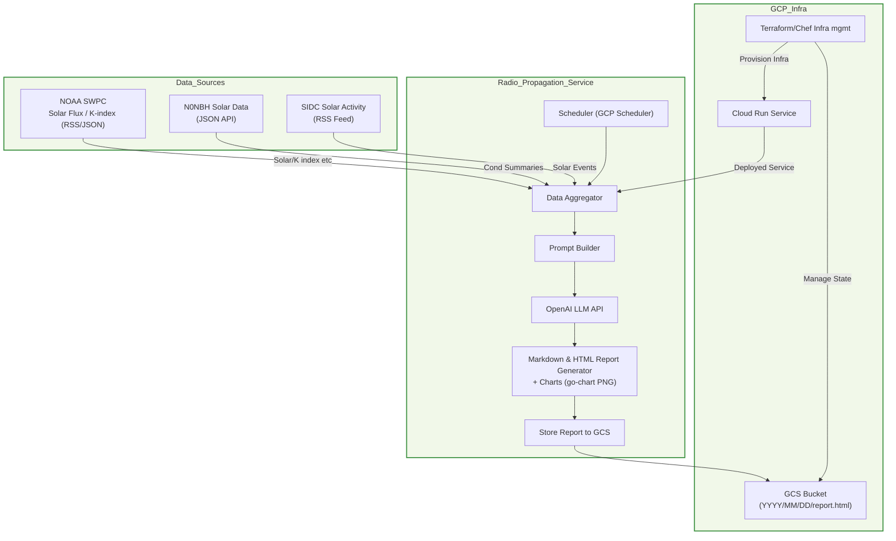
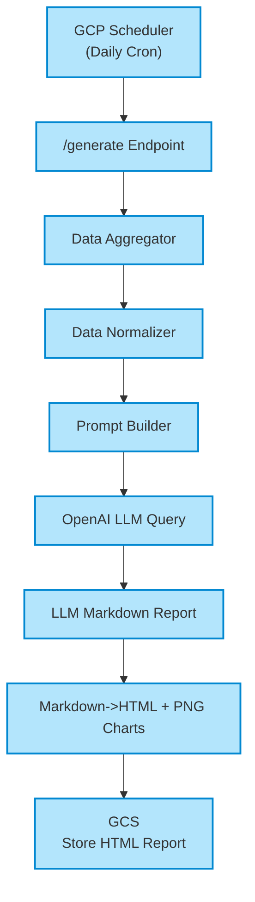
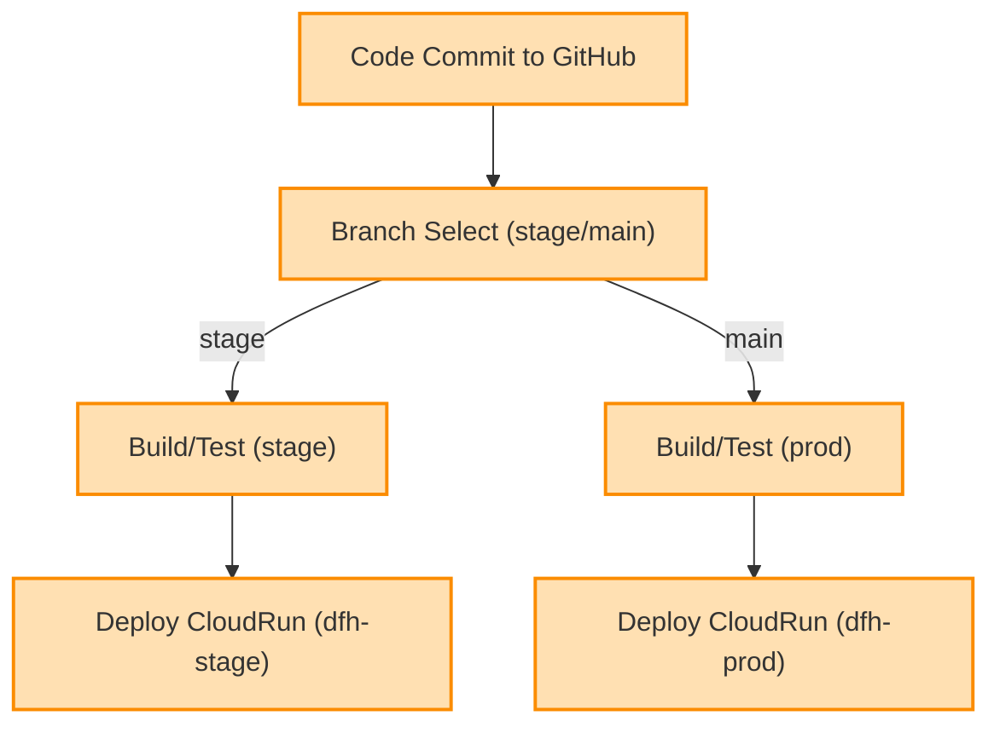
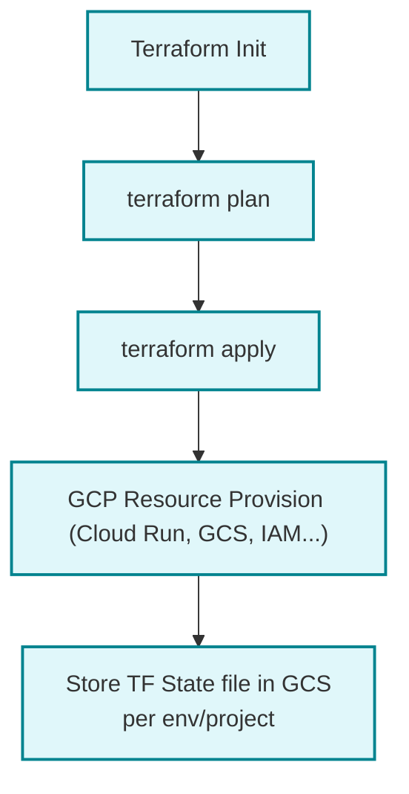

# Radio Propagation Service – Specification

## Architecture Overview

The Radio Propagation Service is a Go-based microservice deployed on Google Cloud Run that:
- Fetches real-time space weather data from NOAA SWPC, N0NBH, and SIDC APIs
- Uses OpenAI GPT models to generate intelligent propagation analysis
- Creates static PNG charts using go-chart library
- Stores reports in timestamped GCS folder structure
- Provides REST API endpoints for report generation and file serving
- Implements universal file proxy system for serving any file type from report folders

## 1. Project Overview

The Radio Propagation Service is a Go-based application that generates daily radio propagation reports for amateur radio operators. It fetches solar and geomagnetic data from multiple sources, uses OpenAI LLM to generate comprehensive reports, and creates both interactive HTML charts and PNG chart images for enhanced visualization.

**Key Features:**
- Automated data collection from NOAA SWPC, N0NBH, and SIDC sources
- AI-powered report generation using OpenAI GPT models
- Static PNG chart generation with go-chart library
- PNG chart generation and upload to GCS bucket
- Dual deployment modes: local testing and GCP Cloud Run production
- Comprehensive CI/CD pipeline with GitHub Actions
- Infrastructure as Code using Terraform

## 2. Versioning Strategy

- **Git-Based Versioning**: Version calculated as `{BASE_VERSION}.{COMMIT_COUNT}` from `/VERSION` file and git commit count
- **Stage Environment**: Appends `-rc.{timestamp_suffix}` to version (e.g., `0.1.0.1234-rc.5678`)
- **Production Environment**: Uses clean format `{BASE_VERSION}.{COMMIT_COUNT}` (e.g., `0.1.0.1234`)
- **Implementation**: GitHub Actions workflows calculate version using `git rev-list --all --count HEAD`
- **Base Version**: Stored in `/VERSION` file at project root, manually updated for major/minor releases

**Version Increment Rules**:
- **PATCH**: Bug fixes, minor updates (auto-incremented on prod deployment)
- **MINOR**: New features, backward-compatible changes (manual)
- **MAJOR**: Breaking changes, major releases (manual)

## 3. Application Architecture



## 4. Component Details

| Component                 | Description                                                                              |
|---------------------------|------------------------------------------------------------------------------------------|
| Data Fetcher              | Collects solar/space weather data from NOAA SWPC, N0NBH API, and SIDC RSS.              |
| Data Normalizer           | Normalizes all incoming data to a common internal struct format.                         |
| Prompt Builder            | Generates a detailed prompt (with all relevant data) for OpenAI API.                     |
| OpenAI Integration        | Calls OpenAI LLM (e.g., GPT-4 API) with prompt, receives Markdown summary report.        |
| Report Generator          | Renders Markdown as HTML, embeds static PNG charts (solar activity, K-index, etc).      |
| Scheduler                 | Uses GCP Scheduler to hit /generate endpoint daily (UTC midnight or customized).         |
| Storage Handler           | Saves generated report as HTML to GCS bucket with timestamped folder structure: `YYYY/MM/DD/PropagationReport-YYYY-MM-DD-HH-MM-SS/index.html` and PNG chart images in same folder. |
| Configuration/Secrets     | Managed via GCP Secret Manager or env vars (for OpenAI keys, API keys, etc.)            |
| Infra Provisioning        | Infrastructure managed via Terraform/Chef, with backend on GCS; separate state for stage/prod. |
| CI/CD Pipeline            | Uses Github Actions for build, test, deploy workflows; deploys stage branch to dfh-stage, main to dfh-prod. |

## 5. Functional Requirements

#### 4.1 Data Ingestion
- Fetches and parses:
    - **NOAA SWPC RSS/JSON**: Solar flux, K-index, 3-day forecast
    - **N0NBH Solar Data**: JSON, solar conditions & band openings
    - **SIDC RSS**: Solar event alerts
- Supports error handling, timeouts, and retries.

#### 4.2 Data Analysis & Prompting
- Normalizes all source data into a unified structure.
- Constructs an intelligent, descriptive prompt for OpenAI:
    - Summarized measurements and notable events
    - Request for band condition analysis, propagation advice, and user-friendly explanations

#### 4.3 LLM-driven Reporting
- Calls OpenAI LLM, passing data prompt; expects Markdown summary as output.
- Handles LLM response formatting and error handling.

#### 4.4 Report Rendering & Chart Generation
- **Chart Library**: `github.com/wcharczuk/go-chart/v2` for static PNG generation with precise styling control
- **Chart Types**: 
  - Bar charts: Solar activity metrics, HF band conditions with color-coded quality levels
  - Time series: K-index trends with reference lines for quiet/active thresholds
  - Forecast charts: 3-day K-index predictions with orange trend lines
- **Chart Specifications**:
  - Resolution: 600x400px (solar/band), 500x300px (forecast), 600x300px (K-index)
  - Color scheme: Green (excellent), Yellow (good), Orange (fair), Red (poor), Gray (closed)
  - Font: Arial with size-specific styling (16px titles, 12px labels, 10px axes)
- **Deployment Modes**:
  - **Local**: Charts saved to `./test_charts_output/` or `./reports/timestamp/`
  - **GCS**: Charts uploaded to timestamped folder alongside HTML report
- **File Names**: `solar_activity.png`, `k_index_trend.png`, `band_conditions.png`, `forecast.png`

#### 4.5 Scheduling & Automation
- Exposes `/generate` REST endpoint.
- GCP Scheduler triggers this endpoint on a set schedule (e.g., each day at 00:00 UTC).

#### 5.6 Report Storage
- **HTML Reports**: Stored in GCS with timestamped folder structure:
    ```
    gs://bucket/YYYY/MM/DD/PropagationReport-YYYY-MM-DD-HH-MM-SS/index.html
    ```
- **PNG Chart Images**: Stored alongside reports for direct access:
    ```
    gs://bucket/YYYY/MM/DD/PropagationReport-YYYY-MM-DD-HH-MM-SS/
    ├── index.html
    ├── solar_activity.png
    ├── k_index_trend.png
    ├── band_conditions.png
    └── forecast.png
    ```
- **File Proxy System**: `/files/` endpoint serves any file type from report folders

#### 4.7 Environment Separation & Deployment
- **Two GCP Projects**:
    - **dfh-stage-id**: Stage environment (stage branch) with `-rc` version suffix
    - **dfh-prod-id**: Production environment (main branch) with clean versioning
- **Infrastructure Isolation**: Separate Terraform backends, GCS buckets, service accounts, and IAM policies
- **Configuration Management**: Environment-specific `.tfvars` files, Secret Manager per project
- **Deployment Strategy**: Identical container images with environment-specific configuration injection

## 6. Non-functional Requirements

| Requirement              | Technical Implementation                          |
|--------------------------|---------------------------------------------------|
| **Logging & Monitoring** | Structured logging with `log.Printf()`, GCP Cloud Monitoring alerts, health probe endpoints, error tracking |
| **Security**             | Service account authentication, Secret Manager integration, IAM least privilege, path traversal protection in file proxy |
| **Reliability**          | HTTP client timeouts, retry logic in fetchers, fallback data handling, graceful degradation for missing APIs |
| **Code Structure**       | Standard Go `/internal` layout, dependency injection, organized Terraform files by logical grouping with shared/environment-specific configs |
| **Performance**          | HTTP cache headers (`max-age=3600/86400`), efficient PNG chart generation, minimal memory footprint |
| **Testing**              | Comprehensive unit tests with real API validation, local testing suite, automated smoke tests in CI/CD |
| **Configuration**        | Environment-based config with `github.com/sethvargo/go-envconfig`, default values, validation |

## 7. Project Structure

```plain
/radiocast
  /service      // Go application source
    main.go
    go.mod, go.sum
    Dockerfile, .dockerignore
    run_local.sh              // Local testing script
    /cmd
      /local-runner           // Local testing mode
      /test_charts.go         // Chart generation testing
    /internal                 // Standard Go layout
      /config                 // Configuration management
      /fetchers               // Data fetching with comprehensive tests
      /llm                    // OpenAI integration
      /models                 // Data structures
      /reports                // Report & chart generation
        generator.go          // HTML report generation
        charts.go             // PNG chart generation (go-chart)
      /storage                // GCS storage client
    /test_charts_output       // Local chart testing output
  /terraform    // Infrastructure as Code
    main.tf                       // Provider configuration only
    apis.tf                       // Google Cloud service enablement
    storage.tf                    // GCS bucket and IAM policies
    secrets.tf                    // Secret Manager resources
    iam.tf                        // Service account and permissions
    cloud-run.tf                  // Cloud Run service configuration
    scheduler.tf                  // Cloud Scheduler job
    monitoring.tf                 // Alert policies and monitoring
    variables.tf, backend.tf, outputs.tf, versions.tf
    /stage                        // Stage environment configs
      backend.tf                  // Stage backend configuration
      stage.tfvars               // Stage environment variables
    /prod                         // Production environment configs
      backend.tf                  // Production backend configuration
      prod.tfvars                // Production environment variables
  /.github
    /workflows
      stage.yml   // Staging deployment pipeline
      prod.yml    // Production deployment pipeline
  README.md
  Specification.md
  .gitignore
```

## 8. Development & Testing Modes

### 8.1 Local Testing Workflow (Pre-GitHub Validation)
**Purpose**: Comprehensive local validation before pushing to GitHub

**Environment Setup**

For local development and testing, you'll need to set up the following environment variables:

```bash
export OPENAI_API_KEY="your-openai-api-key"
export OPENAI_MODEL="gpt-4.1"  # Default model
export PORT="8981"  # Default local port
export LOCAL_REPORTS_DIR="./reports"
```

**CRITICAL SECURITY NOTE**: Never use dummy or placeholder OpenAI API keys for testing. Always ensure a valid OPENAI_API_KEY is properly set before running any tests that require LLM functionality. The service will fail gracefully if the key is missing or invalid.

**Testing Commands**:
```bash
cd service

# 1. Unit tests (no API key required)
./run_local.sh unit-tests

# 2. API connectivity check (no API key required)
./run_local.sh debug-apis

# 3. Complete end-to-end test
./run_local.sh server
```

**Local Testing Features**:
- **Timestamped Reports**: Saves to `./reports/YYYY-MM-DD_HH-MM-SS/` directory structure
- **Debug Artifacts**: Saves API data JSON, LLM prompts, markdown responses, and final HTML
- **Chart Generation**: Creates PNG charts in local output directory using `go-chart/v2`
- **Health Checks**: Validates server startup, API connectivity, and report generation
- **Real API Data**: Tests against live NOAA, N0NBH, and SIDC endpoints
- Creates both interactive HTML charts and PNG images
- No GCS upload - purely local file system
- Serves reports on `http://localhost:8981`
- Essential for validating changes before deployment

**Chart Testing**:
```bash
./radiocast -test-charts  # Generate test charts only
```

### 8.2 GCP Cloud Run Mode
**Purpose**: Production deployment with full GCS integration

**Features**:
- PNG chart generation and upload to GCS bucket
- HTML reports reference GCS-hosted chart images
- Automatic report storage with timestamp-based paths
- Scalable Cloud Run deployment
- Integrated with GitHub Actions CI/CD

**Critical Requirement**: Always test locally before pushing to GitHub to avoid build failures

## 9. CI/CD Pipeline

| Environment  | Github Branch | CI/CD Triggers (Github Actions)                                 | GCP Project    | GCS bucket Separation            |
|--------------|--------------|-----------------------------------------------------------------|---------------|-----------------------------------|
| Staging      | stage        | On push/PR to stage: build/test/deploy to CloudRun (dfh-stage)  | dfh-stage     | e.g. gs://dfh-stage-reports/     |
| Production   | main         | On push/PR to main: build/test/deploy to CloudRun (dfh-prod)    | dfh-prod      | e.g. gs://dfh-prod-reports/      |
| Both         | Any          | GCS backend for Terraform state storage, isolated per project   | Both          | e.g. gs://dfh-stage-tfstate/, gs://dfh-prod-tfstate/ |

## 10. Key Dependencies

| Purpose         | Go Package                             |
|-----------------|---------------------------------------|
| HTTP Client     | net/http, github.com/go-resty/resty   |
| Parsing RSS/XML | github.com/mmcdole/gofeed             |
| JSON Handling   | encoding/json                         |
| Markdown->HTML  | github.com/russross/blackfriday/v2    |
| Static PNG Charts | github.com/wcharczuk/go-chart/v2      |
| PNG Charts      | github.com/wcharczuk/go-chart/v2      |
| Cloud Storage   | cloud.google.com/go/storage           |
| LLM API         | github.com/sashabaranov/go-openai (or direct HTTP) |
| Scheduling      | Trigger from GCP Scheduler (REST call to /generate) |
| Env/Secrets     | os, github.com/sethvargo/go-envconfig, Secret Manager API |

## 11. Development Workflow

### 11.1 Pre-Deployment Testing Requirements

**CRITICAL**: Always perform comprehensive local testing before pushing to stage branch.

**Required Local Testing Steps**:
```bash
cd service

# 1. Run unit tests
go test -v ./...

# 2. Verify build
go build -o radiocast

# 3. Test chart generation
./radiocast -test-charts

# 4. Test server startup and health
timeout 10s ./radiocast -deployment local &
sleep 2
curl -f http://localhost:8981/health
pkill radiocast

# 5. Run comprehensive test suite
./run_local.sh unit-tests
```

**Never push to stage without passing all local tests first.**

### 11.2 Monitoring GitHub Actions

**IMPORTANT**: Never run `gh run watch` without a job ID - it will prompt for user input and hang.
GitHub CLI authentication is required and assumed to be already configured.

**Step-by-step monitoring process**:

1. **Find latest build**:
```bash
gh run list --branch stage --limit 3
```

2. **Watch specific build** (use job ID from step 1):
```bash
gh run watch <job-id>                    # Watch specific build in real-time
```

3. **View build summary**:
```bash
gh run view <job-id>                     # View build summary and status
```

**Example workflow**:
```bash
# 1. List recent builds
gh run list --branch stage --limit 3

# 2. Watch the latest build (replace with actual ID)
gh run watch 17352269025

# 3. Check final status
gh run view 17352269025
```

4. **If build fails, check logs**:
```bash
gh run view <job-id> --log-failed        # View only failed job logs
gh run view <job-id> --log               # View complete build logs
```

5. **Check Cloud Run container logs** (if deployment fails):
```bash
# Replace revision name with actual failing revision from Terraform error
gcloud logging read "resource.type=cloud_run_revision AND resource.labels.service_name=radiocast-stage AND resource.labels.revision_name=radiocast-stage-00038-7nx" --limit=10 --project=dfh-stage-id --format="value(timestamp,textPayload)"
```

**If build fails**:
1. Check logs: `gh run view <job-id> --log-failed`
2. Check Cloud Run logs if deployment step failed
3. Fix issues locally
4. Test fixes thoroughly (see 11.1)
5. Commit and push fixes
6. Monitor new build using steps above

### 11.3 Stage Deployment Verification

**CRITICAL**: Health check alone is NOT sufficient. You MUST test all API endpoints after every successful stage deployment.

**Required API endpoint testing** (in this specific order):
```bash
# 1. Check deployment health (basic connectivity)
curl https://stage.radio-propagation.net/health

# 2. MANDATORY: Test report generation FIRST (core functionality)
curl -X POST https://stage.radio-propagation.net/generate

# 3. Test root endpoint (service info and available endpoints)
curl https://stage.radio-propagation.net/

# 4. MANDATORY: List available reports (verify storage integration)
curl https://stage.radio-propagation.net/reports
```

**All four endpoints must respond correctly before considering deployment successful.**

**Verify GCS bucket contents**:
```bash
# List recent reports in GCS bucket
gsutil ls -r gs://dfh-stage-reports/$(date +%Y)/ | tail -20

# Check latest report directory has all expected files
# Expected files for each report:
# - index.html (main report)
# - band_conditions.png (band conditions chart)
# - forecast.png (forecast chart)
# - k_index_trend.png (K-index trend chart)
# - solar_activity.png (solar activity chart)

# Example: Check specific report directory
gsutil ls gs://dfh-stage-reports/2025/08/31/PropagationReport-2025-08-31-03-32-38/
```

**Manual verification**:
- Visit https://stage.radio-propagation.net in browser
- Generate a test report via web interface
- Verify charts render correctly
- Check report content and formatting
- Confirm all PNG charts load properly in the HTML report

### 11.2 Checking Cloud Run Logs
**View application logs**:
```bash
# Recent logs
gcloud logging read "resource.type=cloud_run_revision AND resource.labels.service_name=radiocast-stage" --limit=50 --project=dfh-stage-id

# PNG chart generation logs
gcloud logging read "resource.type=cloud_run_revision AND textPayload:'DEBUG: Storage client status'" --limit=10 --project=dfh-stage-id

# Chart upload logs
gcloud logging read "resource.type=cloud_run_revision AND textPayload:'Chart image uploaded'" --limit=10 --project=dfh-stage-id
```

### 11.3 GCS Bucket Management
**Check bucket contents**:
```bash
# List recent reports
gsutil ls -la gs://dfh-stage-reports/2025/08/30/

# Check specific report folder
gsutil ls -la gs://dfh-stage-reports/YYYY/MM/DD/PropagationReport-*/

# Verify PNG charts are uploaded
gsutil ls gs://dfh-stage-reports/**/PropagationReport-*/*.png
```

### 11.4 Testing Deployed Service
**Last Updated**: August 30, 2025  
**Status**: Production Ready  
**Staging URL**: https://stage.radio-propagation.net  
**Production URL**: https://radio-propagation.net

**Manual report generation**:
```bash
curl -X POST https://stage.radio-propagation.net/generate
```

**Health check**:
```bash
curl https://stage.radio-propagation.net/health
```

## 12. Detailed Workflows

### 12.1 Report Generation Flow



### 12.2 CI/CD Workflow



### 12.3 Infrastructure Management



## 13. Infrastructure Configuration

**Sample backend config (for each env/proj):**
```hcl
terraform {
  backend "gcs" {
    bucket  = "dfh-stage-tfstate"       # or "dfh-prod-tfstate"
    prefix  = "terraform/state"
  }
}
```

## 14. Report Structure

**HTML Report Components**:
- **Header**: Date, summary, key indicators (K-index, Solar Flux, Sunspot Number)
- **AI-Generated Content**: LLM analysis with band recommendations and operating advice
- **Static PNG Charts**: Data visualization with go-chart library
- **PNG Chart Images**: Reliable fallback images hosted on GCS
- **Technical Data**: Raw measurements and data sources
- **Responsive Design**: Mobile-friendly CSS with modern styling

**Chart Types**:
- Solar Activity (flux, sunspot trends)
- K-Index Trend (geomagnetic activity)
- Band Conditions (day/night propagation matrix)
- 3-Day Forecast (predicted conditions)

## 15. Deployment Requirements

- All configuration (API keys, project IDs, bucket names) must be environment-variable driven.
- Use IAM/service accounts for Cloud Storage and Secret Manager access.
- Terraform manages all infrastructure with organized configuration files split by logical grouping.
- **CRITICAL**: Always use `terraform/terraform.sh` script for Terraform operations - never use raw `terraform` commands directly.
- The `terraform.sh` script automatically substitutes the correct `backend.tf` file for the specified environment before executing Terraform commands.
- CI/CD workflows use Terraform for deployment instead of direct gcloud commands.
- Environment variables passed to Terraform via `TF_VAR_` prefix for secure secret handling.

## 16. Testing & Quality Assurance

**Testing Strategy**:
- **Local Testing**: Always test locally before GitHub pushes
- **Unit Tests**: Comprehensive coverage for fetchers, data validation, chart generation
- **Integration Tests**: Real API data validation and error handling
- **Build Verification**: Local `go build` and `go test ./...` before deployment
- **End-to-End Testing**: Full report generation pipeline validation

**Quality Gates**:
- All tests must pass in GitHub Actions
- Docker build must succeed locally and in CI
- Chart generation must produce valid PNG files
- GCS upload functionality must be verified in logs

## 17. Recent Implementation Updates (August 2025)

### Chart Generation System Enhancement:
- **PNG Chart Architecture**: Static PNG images using go-chart library
- **GCS Integration**: Automatic PNG upload during production deployment
- **Chart Display Fix**: HTML reports now properly reference GCS-hosted PNG images
- **Local Testing**: Complete chart generation testing in local mode
- **Debug Logging**: Comprehensive logging for chart generation and upload process

### Development Workflow Improvements:
- **Local-First Testing**: Mandatory local testing before GitHub pushes
- **Build Verification**: Local compilation checks prevent CI/CD failures
- **Operational Guides**: Complete documentation for monitoring and troubleshooting
- **Error Handling**: Robust error handling for API failures and chart generation

### Infrastructure Maturity:
- **Production-Ready**: Full GCS integration with reliable chart image serving
- **Monitoring**: Complete logging and debugging capabilities
- **Scalability**: Cloud Run deployment with proper resource management
- **Security**: Service account-based authentication and secret management

## 18. External Data Sources

| Type                 | Example URL/Endpoint                                        |

## API Endpoints

### Core Endpoints

| Endpoint | Method | Description | Response | Technical Notes |
|----------|--------|-------------|----------|----------------|
| `/health` | GET | Health check endpoint | `{"status": "healthy", "timestamp": "..."}` | Used by Cloud Run health probes |
| `/generate` | POST | Generate new propagation report | `{"message": "...", "report_url": "..."}` | Triggers full data fetch, LLM analysis, chart generation, and GCS storage |
| `/latest` | GET | Retrieve latest report | HTML content | Serves most recent report from GCS |
| `/reports` | GET | List recent reports | JSON array of report metadata | Paginated list with creation timestamps |
| `/files/{path}` | GET | Universal file proxy | Any file type with proper MIME headers | Serves PNG, HTML, CSS, JS, JSON, TXT, MD, PDF from report folders |

### File Proxy System
- **Local Mode**: `/files/{filename}` - serves from local filesystem
- **GCS Mode**: `/files/{YYYY/MM/DD/PropagationReport-YYYY-MM-DD-HH-MM-SS}/{filename}` - serves from GCS
- **Security**: Path traversal protection, content-type detection
- **Performance**: Cache headers (`max-age=3600` for files, `max-age=86400` for images)
